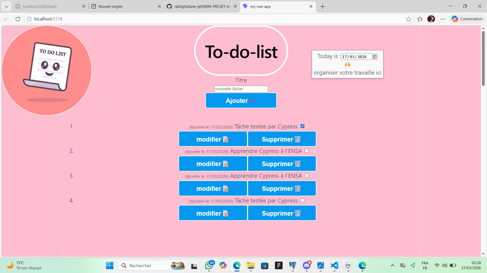
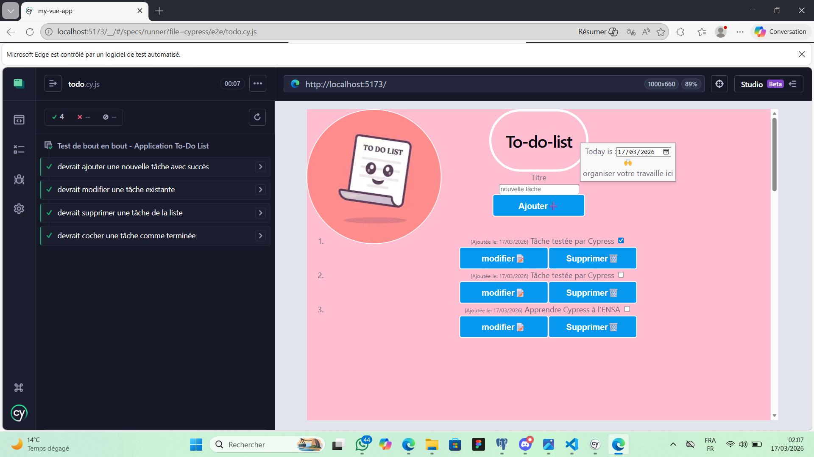
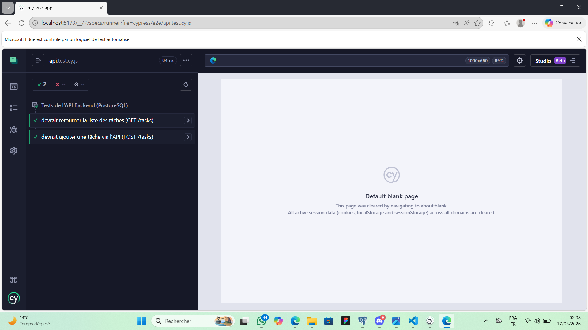

# MINI-PROJET-to-do-list.
Ma première application web

# 📝 To-Do List Full-Stack (Vue.js + Express + PostgreSQL)

Ce projet est une application de gestion de tâches complète développée dans le cadre du **Cycle d'Ingénieur à l'ENSA Tanger**.

## 🚀 Technologies utilisées
* **Frontend:** Vue.js 3, Vite, CSS3
* **Backend:** Node.js, Express.js
* **Base de données:** PostgreSQL
* **Tests:** Cypress (E2E & API Testing)
* **Outils:** Git, GitHub

## 🛠️ Installation et Lancement

### 1. Base de données
* Créez une base de données nommée `todo_db` sur PostgreSQL.
* Exécutez le script SQL se trouvant dans `/server-api/database/init.sql`.

### 2. Backend
```bash
cd server-api
npm install
node app.js
'''
### 3. frontend
'''
cd my-vue-app
npm install
npm run dev
'''
### 4. 🧪 Tests avec Cypress
cd my-vue-app
npx cypress open
'''


